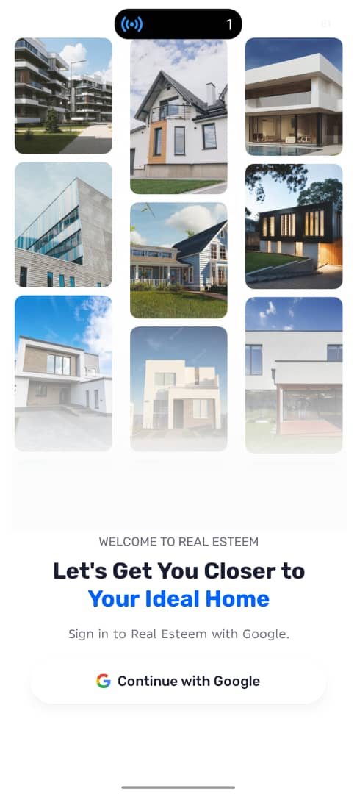
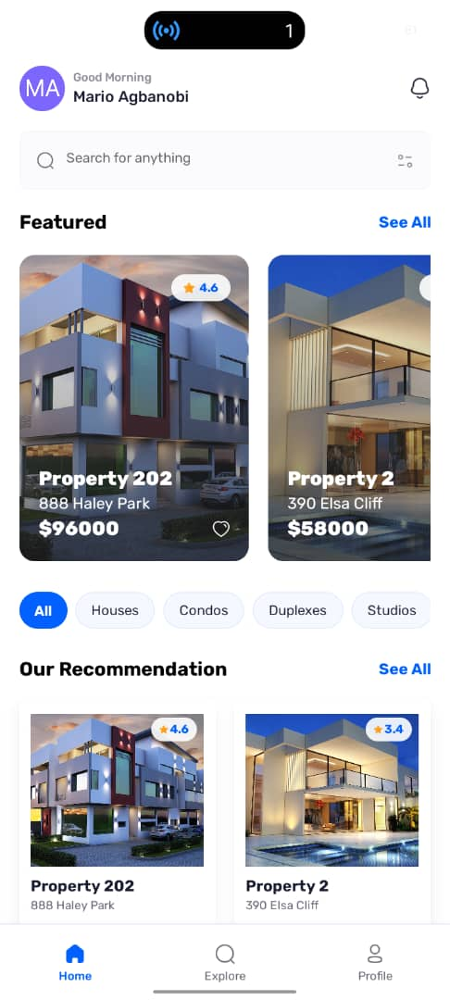
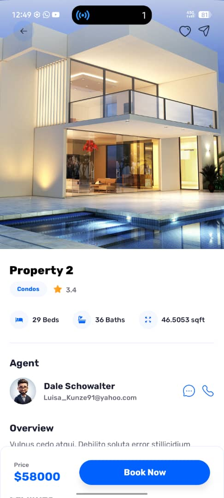
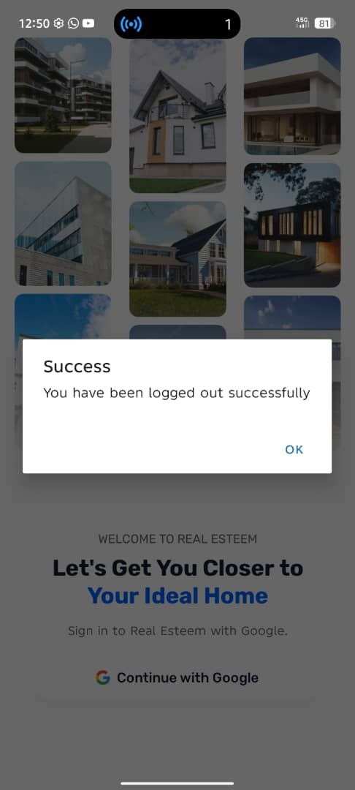

# RealEsteem - Your Gateway to Dream Properties
A modern and elegant React Native mobile application for discovering, exploring, and booking real estate properties, powered by Appwrite backend services and Google OAuth authentication.

## 📱 Screenshots
<div style="display: flex; flex-wrap: wrap; gap: 10px;">
    
    
    
    
    
    
    <!-- Add more screenshots as they become available -->
</div>

## ✨ Features

### 🏠 Property Discovery
- **Real-time Search** - Fast search with instant results
- **Featured Properties** - Showcase of premium listings
- **Property Filters** - Filter by type, price, location
- **Detailed Views** - Comprehensive property information
- **High-Quality Images** - Professional property photos and galleries

### 🔍 Smart Search & Filters
- Real-time property search
- Filter by property type (Apartment, House, Condo, Villa, etc.)
- Search by location, name, or type
- Dynamic results with unlimited listings

**Filter Options:**
- Property Type filtering
- Location-based search
- Price range selection
- Sort by latest listings

### 🔐 Authentication
- **Google OAuth** - Secure sign-in with Google
- **Session Management** - Persistent user sessions
- **User Profiles** - Personalized user experience
- **Avatar Integration** - User initials avatars from Appwrite

### 💾 Backend Features (Appwrite)
- **Property Database** - Comprehensive property listings
- **Agent Management** - Real estate agent profiles
- **Gallery System** - Multiple property images
- **Reviews System** - Property ratings and reviews (coming soon)
- **Real-time Sync** - Cloud-based data synchronization

### 🎨 UI/UX
- Clean and modern interface
- Smooth animations and transitions
- Grid and list layouts
- Horizontal scrolling featured section
- Bottom tab navigation
- Professional loading states
- Responsive design

### 📍 Property Details
- Property specifications (bedrooms, bathrooms, area)
- Agent information with contact options
- Facilities
- Gallery
- Location map
- Price and booking options

## 🚀 Technology Stack

- **Frontend**
  - React Native
  - Expo SDK 54
  - TypeScript
  - NativeWind (Tailwind CSS)
  - Expo Router (File-based routing)

- **Backend**
  - Appwrite Cloud
  - Appwrite Databases
  - Appwrite Authentication (OAuth)
  - Appwrite Storage

- **State Management**
  - React Context API
  - Custom hooks (useAppwrite)
  - Global state provider

- **Authentication**
  - Google OAuth 2.0
  - Expo Web Browser
  - Expo Linking

## 📋 Prerequisites

- Node.js >= 14
- npm or yarn
- Expo CLI
- iOS Simulator/Android Emulator or Physical Device
- Appwrite Account
- Google OAuth Credentials

## 🛠️ Installation & Development

### Quick Start

```bash
# Install dependencies
npm install --legacy-peer-deps

# Run the project
npx expo start

# Clean start (if needed)
npx expo start -c

# Check project health
npx expo-doctor
```

### Full Installation

1. Clone the repository:
```bash
git clone https://github.com/MarioAgbanobi/React-Native-RealEstate.git
```

2. Navigate to project directory:
```bash
cd React-Native-RealEstate
```

3. Install dependencies:
```bash
npm install --legacy-peer-deps
```

4. Set up environment variables (see below)

5. Run the app:
```bash
npx expo start
```

## 🔐 Environment Variables

Create a `.env` file in the root directory:

```env
# Appwrite Configuration
EXPO_PUBLIC_APPWRITE_ENDPOINT=https://cloud.appwrite.io/v1
EXPO_PUBLIC_APPWRITE_PROJECT_ID=your_project_id
EXPO_PUBLIC_APPWRITE_DATABASE_ID=your_database_id

# Collection IDs
EXPO_PUBLIC_APPWRITE_PROPERTIES_TABLE_ID=your_properties_collection_id
EXPO_PUBLIC_APPWRITE_AGENTS_TABLE_ID=your_agents_collection_id
EXPO_PUBLIC_APPWRITE_GALLERIES_TABLE_ID=your_galleries_collection_id
EXPO_PUBLIC_APPWRITE_REVIEWS_TABLE_ID=your_reviews_collection_id
```

### Getting Started with Appwrite

1. **Create Appwrite Account**
   - Visit [Appwrite Console](https://cloud.appwrite.io)
   - Create a new project
   - Copy your Project ID

2. **Database Setup**
   - Create a database named "realesteem"
   - Create the following collections:

   **Properties Collection:**
   - `name` (String, 255)
   - `description` (String, 5000)
   - `price` (Integer)
   - `image` (String, 1000)
   - `bedrooms` (Integer)
   - `bathrooms` (Integer)
   - `area` (Integer)
   - `address` (String, 500)
   - `type` (String, 100)
   - `rating` (Float)
   - `facilities` (String Array)
   - `agent` (Relationship to Agents)
   - `gallery` (Relationship to Galleries)

   **Agents Collection:**
   - `name` (String, 255)
   - `email` (String, 255)
   - `avatar` (String, 1000)
   - `phone` (String, 50)

   **Galleries Collection:**
   - `image` (String, 1000)
   - `property` (Relationship to Properties)

3. **Authentication Setup**
   - Enable Google OAuth in Authentication → Settings
   - Add your OAuth credentials
   - Configure redirect URLs:
     - Success: `realesteem://`
     - Failure: `realesteem://`

4. **Platform Configuration**
   - Add platform in Settings → Platforms
   - Type: Flutter (for mobile apps)
   - Package Name: `com.aime.realesteem`

5. **Set Permissions**
   - Collections: Read (Any), Create (Users)
   - Documents: Read (Any), Update (Users), Delete (Users)

### app.json Configuration

Update your `app.json` with the correct scheme:

```json
{
  "expo": {
    "name": "RealEsteem",
    "slug": "realesteem",
    "scheme": "realesteem",
    "ios": {
      "bundleIdentifier": "com.aime.realesteem"
    },
    "android": {
      "package": "com.aime.realesteem"
    }
  }
}
```

## 🏗️ Project Structure

```
realesteem/
├── app/                      # Application screens (Expo Router)
│   ├── (root)/              # Root group
│   │   └── (tabs)/          # Tab navigation
│   │       ├── index.tsx    # Home screen
│   │       ├── explore.tsx  # Explore properties
│   │       ├── profile.tsx  # User profile
│   │       └── _layout.tsx  # Tab layout
│   ├── properties/          # Dynamic routes
│   │   └── [id].tsx         # Property details
│   ├── sign-in.tsx          # Authentication screen
│   └── _layout.tsx          # Root layout
├── components/              # Reusable UI components
│   ├── Cards.tsx            # Property cards
│   ├── Filters.tsx          # Filter component
│   ├── Search.tsx           # Search bar
│   └── CustomBottomNav.tsx  # Custom navigation
├── lib/                     # Services and utilities
│   ├── appwrite.ts          # Appwrite configuration
│   ├── global-provider.tsx  # Global state
│   └── useAppwrite.ts       # Custom fetch hook
├── constants/               # Constants and configuration
│   ├── images.ts            # Image assets
│   ├── icons.ts             # Icon assets
│   └── data.ts              # Static data (facilities, etc.)
├── types/                   # TypeScript type definitions
└── assets/                  # Static assets
```

## 🎯 Usage

### Authentication
1. Launch the app
2. Tap "Continue with Google"
3. Sign in with your Google account
4. Redirected to home screen

### Browsing Properties
1. **Home Screen** - View featured properties and recommendations
2. **Search** - Use the search bar to find properties
3. **Filters** - Filter by property type
4. **Property Details** - Tap any property to view full details

### Property Details
- View comprehensive property information
- See agent details with contact options
- Browse image gallery
- Check facilities and amenities
- View location on map
- Book property

### Profile Management
1. View your profile information
2. Access saved properties (coming soon)
3. Manage settings
4. Log out

## 🔄 API Integration

### Appwrite Functions

```typescript
// Authentication
login() - Google OAuth sign-in
logout() - Sign out current user
getCurrentUser() - Get authenticated user

// Properties
getLatestProperties() - Fetch 5 latest properties
getProperties({ filter, query, limit }) - Search with filters
getPropertyById({ id }) - Get single property details
```

### Custom Hooks

```typescript
// useAppwrite - Generic data fetching hook
const { data, loading, error, refetch } = useAppwrite({
  fn: getProperties,
  params: { filter, query, limit },
  skip: false
});

// useGlobalContext - Access global state
const { user, isLogged, loading, refetch } = useGlobalContext();
```

## 🚧 Upcoming Features

- [ ] Save favorite properties
- [ ] Property comparison
- [ ] Advanced filters (price range, location)
- [ ] Mortgage calculator
- [ ] Virtual property tours
- [ ] In-app messaging with agents
- [ ] Property reviews and ratings
- [ ] Booking management
- [ ] Push notifications
- [ ] Dark mode
- [ ] Multi-language support
- [ ] Property recommendations based on preferences

## 🐛 Known Issues

- Worklets version mismatch warning (safe to ignore with `react-native-worklets-core` installed)
- Avatar images require proper URL format from Appwrite

## 🔧 Troubleshooting

### SDK Version Mismatch
```bash
# Uninstall and reinstall Expo Go on your device
# Then clear cache and restart
npx expo start -c
```

### Login Issues
```bash
# Make sure your app.json has the correct scheme
# Verify Appwrite OAuth settings match your redirect URIs
# Check that platform is configured in Appwrite console
```

### Package Installation Issues
```bash
# Always use --legacy-peer-deps flag
npm install --legacy-peer-deps
```

## 🤝 Contributing

Contributions are welcome! Please feel free to submit a Pull Request.

1. Fork the project
2. Create your feature branch (`git checkout -b feature/AmazingFeature`)
3. Commit your changes (`git commit -m 'Add some AmazingFeature'`)
4. Push to the branch (`git push origin feature/AmazingFeature`)
5. Open a Pull Request

## 👥 Authors

- **Your Name** - *Initial work* - [YourGitHub](https://github.com/marioagbanobi)

## 📄 License

This project is licensed under the MIT License - see the [LICENSE](LICENSE) file for details.

## 🙏 Acknowledgments

- [Appwrite](https://appwrite.io/) - Backend as a Service
- [Expo](https://expo.dev/) - React Native framework
- [NativeWind](https://www.nativewind.dev/) - Tailwind CSS for React Native
- React Native Community
- All contributors and testers

## 📞 Support

For support, email marioagbanobi@gmail.com or open an issue in the repository.

## 🌟 Show Your Support

Give a ⭐️ if you like this project!

---

**Built with ❤️ using React Native & Expo**